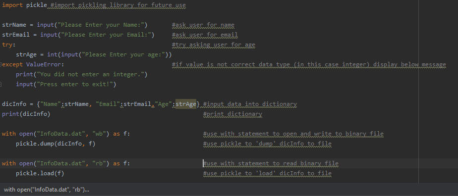

Assignment07
*Anthony DeRitis, 11/20/19*

Introduction

The purpose of this assignment is to get an introductory understanding of how pickling works, and using try/except error handling.
This assignment is to create a python script to demonstrate pickling and try/except error handling using a simple program.  
I created a program that asks the user for their name, email, and age.  This is a very basic program, but includes pickling along
with try/except error handling.

Creating a Python Script
Figure 1

