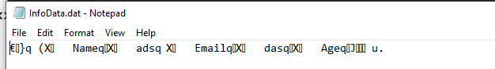

Assignment07
*Anthony DeRitis, 11/20/19*

Introduction

The purpose of this assignment is to get an introductory understanding of how pickling works, and using try/except error handling.
This assignment is to create a python script to demonstrate pickling and try/except error handling using a simple program.  
I created a program that asks the user for their name, email, and age.  This is a very basic program, but includes pickling along
with try/except error handling.

Creating a Python Script
Figure 1

The first step in this assignment was to import the pickle library.  This will allow the developer (me) use the pickling functions.
Next, I am asking the user for data.  The third piece of data is the age of the user.  I want this to be only an integer so I use the 
try/except statement in order to give a custom error to the user.  If the user inputs an integer the program will continue, otherwise the "ValueError" will be utilized.  As the program continues, the information will be stored into a dictionary.  Once it is stored, it will
write the data to a binary file using the with statement along with the pickling function.  This file can be found in the same folder
that the Python file is. (See Below)

This with statement will add the current "dicRow" to a file and create one if there isn't already one available.  The final step of this code will read the binary file.  

Summary

Overall, this assignment gives a good understanding of how to use pickling to serialize data to your computer, then retrieve it using the "dump" and "load" functions.  This will be useful when you want to transfer data over networks and across databases easily.  It should be noted that pickling does not make your program secure, nor does it have security features.  Thus the information stored should not be confidential.  In this assignment I learned that the with statement is a much more efficient way to open/close data as well as writing and reading data.
